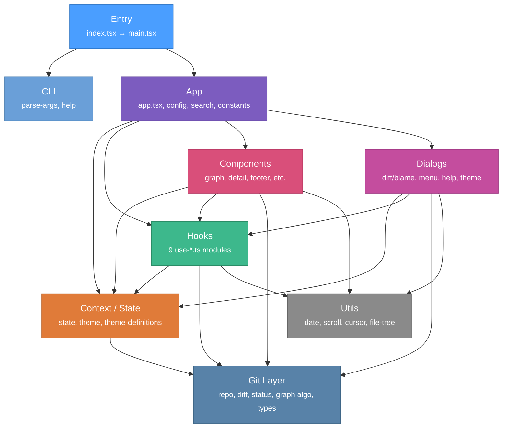

# CodePulse Architecture

## High-Level Architecture

## Layer Summary

| Layer | Files | Role |
|-------|-------|------|
| **Entry** | `index.tsx`, `main.tsx` | Shebang entry, CLI bootstrap, config loading, render |
| **CLI** | `parse-args.ts`, `help.ts` | Argument parsing and `--help` output |
| **App** | `app.tsx`, `config.ts`, `search.ts`, `constants.ts` | Root component orchestration, config I/O, search engine |
| **Context** | `state.ts`, `theme.ts`, `theme-definitions.ts` | SolidJS reactive state and 11 color themes |
| **Hooks** | 9 `use-*.ts` files | Extracted logic: data fetching, keyboard nav, clipboard, etc. |
| **Components** | 9 component files | UI: graph table, detail panel, footer, file tree entries |
| **Dialogs** | 5 dialog files | Overlay UI: diff/blame viewer, menus, help, theme picker |
| **Git** | 10 files | Pure TS git operations: log, diff, blame, graph layout, status |
| **Utils** | 6 utility files | Pure functions: date formatting, scrolling, cursor math |

## Key Observations

- **Clean layering** -- the Git layer has zero UI/framework imports; it is a pure TypeScript data layer.
- **`git/types.ts`** is the most-imported file (~20 importers), acting as the shared vocabulary.
- **`app.tsx`** is the main orchestrator with 18+ internal imports spanning every layer.
- **Components never import other components' hooks** -- hooks are injected from the app level or consumed locally.
- **No circular dependencies** between layers. Data flows top-down: Entry -> App -> Context/Hooks -> Components -> Git/Utils.
